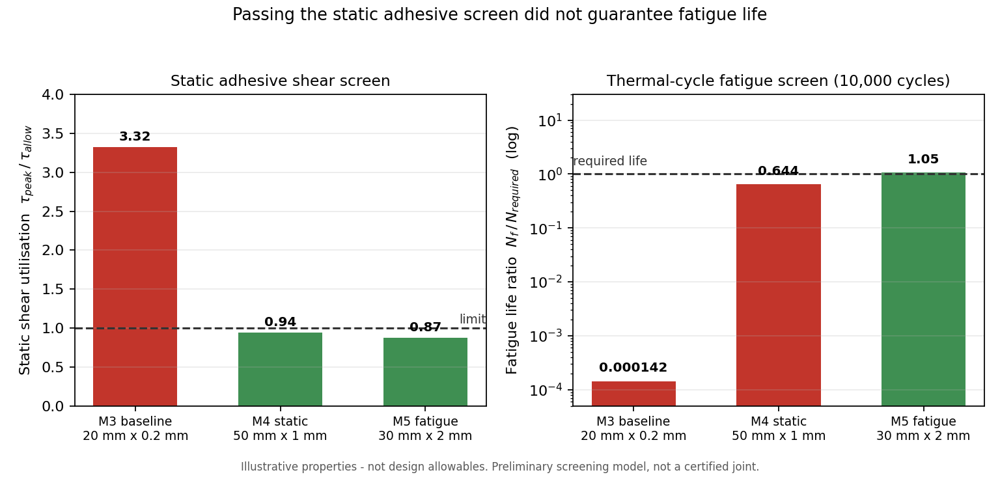
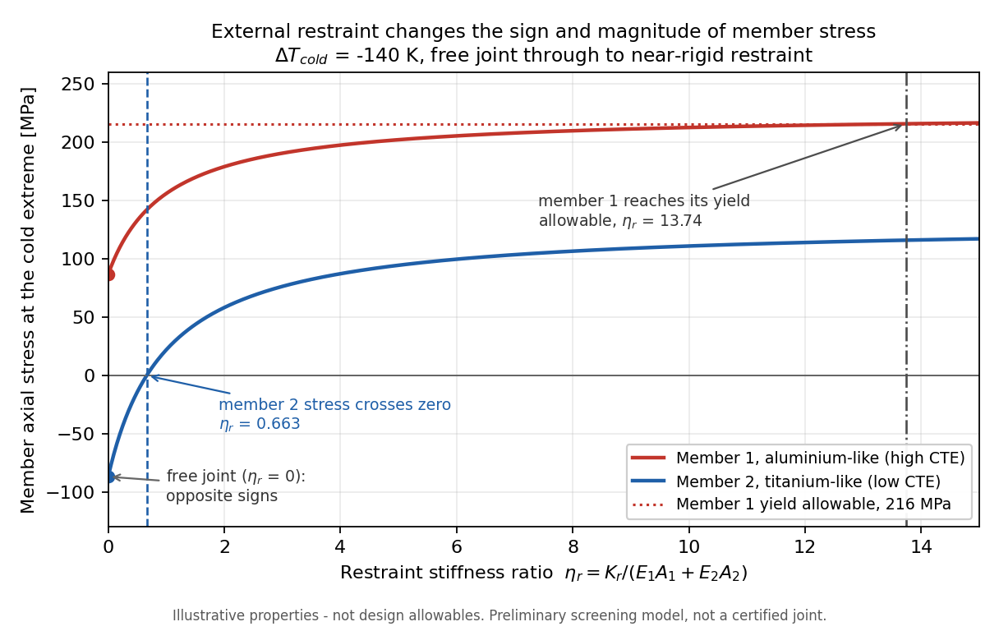
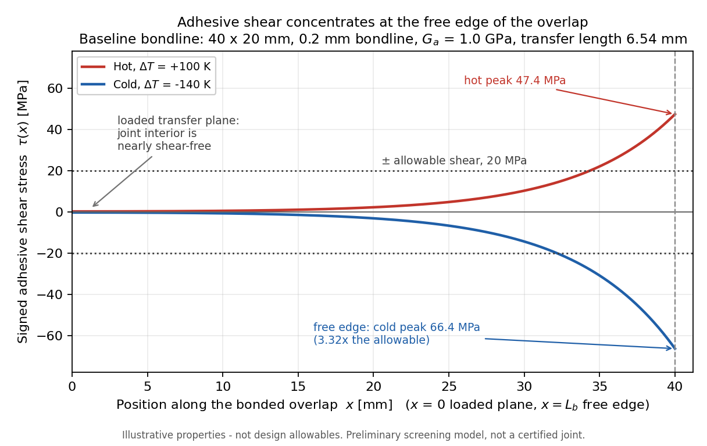
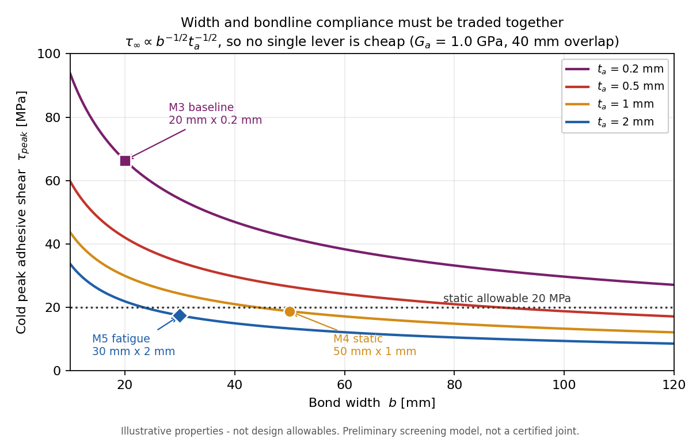

# Bimetallic Joint Thermal Stress

**Thermal-stress, adhesive load-transfer and thermal-cycle fatigue screening for a
dissimilar-metal spacecraft radiator joint.**

> How do CTE mismatch, external restraint, adhesive load transfer, bondline
> geometry and repeated thermal cycling interact in a dissimilar-metal
> spacecraft joint?

A self-contained analytical study in pure Python (standard library only; the
model itself needs no NumPy). Every result below is recomputed from the code by
`examples/final_thermal_joint_assessment.py`, and 938 tests verify the mechanics
against independent closed forms, limiting cases and scaling laws.

> ⚠️ **All material properties, adhesive properties, fatigue curves and design
> requirements in this project are ILLUSTRATIVE and are NOT design allowables.**
> No alloy, adhesive product or S-N dataset is claimed. This is a preliminary
> screening study, not a certified joint design.

---

## Key result

An aluminium-like / titanium-like bonded joint over a −120 °C to +120 °C
excursion. The metal is never the problem; **the bondline is**, and passing the
static shear screen turned out not to be enough.

| Design | Bondline | Static adhesive shear | Metal yield | 10 000-cycle fatigue | Integrated |
|---|---|---|---|---|---|
| **M3 baseline** | 20 mm × 0.2 mm | **FAIL** (MS −0.699) | PASS (+1.487) | **FAIL** (ratio 1.4e−4) | **FAIL** |
| **M4 static-selected** | 50 mm × 1.0 mm | PASS (MS +0.065) | PASS (+1.487) | **FAIL** (ratio 0.644) | **FAIL** |
| **M5 fatigue-selected** | 30 mm × 2.0 mm | PASS (MS +0.147) | PASS (+1.487) | **PASS** (ratio 1.055) | **PASS** |

Three findings drive the study:

1. **The metals pass comfortably.** The free joint gives ±86.84 MPa at the cold
   extreme, a minimum yield margin of **+1.487**. Cold governs.
2. **Overlap length alone cannot fix the bondline.** Peak adhesive shear
   converges on a finite asymptote (66.386 MPa) that already exceeds the 20 MPa
   allowable, so `required_overlap_length` returns
   `no_finite_length_within_model` — no overlap, however long, works.
3. **Static feasibility did not imply fatigue feasibility.** The statically
   acceptable 50 mm × 1.0 mm bondline reaches only **6439 cycles** against
   10 000 required.

External restraint adds a fourth: it can *reverse* a member's stress sign, and
past `eta_r ≈ 13.74` it drives the aluminium-like member to its yield allowable
— so the metal can become limiting after all.



---

## Engineering workflow

```
free bimetallic thermal compatibility     ->  member stress from CTE mismatch alone
  -> finite surrounding-structure restraint  ->  sign changes, stress amplification
  -> finite-overlap adhesive shear-lag       ->  how that force actually transfers
  -> bounded bondline design trade           ->  which levers recover feasibility
  -> repeated thermal-cycle fatigue screen   ->  does it survive the cycling
  -> final integrated assessment
```

Each layer consumes the verified output of the one above it and adds no new
physics of its own. The shear-lag demand is taken *directly* from the
free-joint solver rather than re-derived, so the levels cannot drift apart.

---

## 1 · Thermal compatibility

Two dissimilar members bonded so they share one axial strain, uniform
temperature, no external load, linear elasticity.

```
eps_th,i   = alpha_i dT
eps_common = (E1 A1 alpha1 + E2 A2 alpha2) / (E1 A1 + E2 A2) * dT
sigma_i    = E_i (eps_common - alpha_i dT)
N_i        = sigma_i A_i           with   N_1 + N_2 = 0
```

**Sign convention** (used everywhere): tension positive, compression negative,
`dT > 0` is heating, positive `alpha` expands on heating.

Illustrative inputs — aluminium-like: E 70 GPa, α 23e−6/K, yield 270 MPa;
titanium-like: E 110 GPa, α 8.5e−6/K, yield 830 MPa; 100 mm² each;
T_ref +20 °C, T_cold −120 °C, T_hot +120 °C; yield design factor 1.25.

| | Hot (+100 K) | Cold (−140 K) |
|---|---|---|
| σ aluminium-like | −62.03 MPa (compression) | **+86.84 MPa** (tension) |
| σ titanium-like | +62.03 MPa (tension) | −86.84 MPa (compression) |
| minimum yield margin | +2.482 | **+1.487** |

The high-CTE member wants to expand more, so the bond restrains it into
compression on heating and tension on cooling. **Cold governs**, because
|−140 K| > |+100 K|.

---

## 2 · External restraint

The surrounding structure is one linear axial spring of stiffness `K_r` [N]
(force per unit strain — an equivalent `EA`, not an N/m translational
stiffness).

```
eta_r      = K_r / (E1 A1 + E2 A2)
eps_common = (E1 A1 alpha1 dT + E2 A2 alpha2 dT + K_r eps_ref)
             / (E1 A1 + E2 A2 + K_r)
```

The denominator is a **sum** of stiffnesses, so the solution is unconditionally
stable. `K_r = 0` recovers the free joint exactly; `K_r → ∞` drives
`eps_common → eps_ref` (canonically 0).



| | Result |
|---|---|
| `eta_r` = 1, cold σ₁ / σ₂ | +156.12 / +22.03 MPa — **both now tensile** |
| `eta_r` = 1, minimum yield margin | +0.384 |
| titanium-like zero-stress crossing | **`eta_r` = 0.663399** (dT-independent) |
| metal yield boundary | **`eta_r` = 13.7405** (`K_r` = 2.4733e8 N) |

The free joint is self-equilibrating — one member in tension, one in
compression. Strong restraint drives *both* to the same sign, so the low-CTE
member must pass through zero stress on the way. That crossing is independent
of `dT`.

---

## 3 · Adhesive shear-lag

A one-dimensional linear-elastic screen for a finite bonded overlap: two axial
adherends, thin constant-thickness adhesive, axial force only, no bending, no
peel, no edge singularity.

```
d2s/dx2 - beta^2 s = 0        beta^2 = (G_a b / t_a)(1/E1A1 + 1/E2A2)
transfer length = 1/beta      lambda = beta L_b
```

On `x ∈ [0, L_b]` with the mismatch force fully developed at the inboard plane
and the free edge unloaded:

```
N_1(x) = N_t [1 - sinh(beta x)/sinh(beta L_b)]        N_2(x) = -N_1(x)
tau(x) = -(N_t beta / b) cosh(beta x)/sinh(beta L_b)
```

`|tau| ∝ cosh(beta x)` is strictly increasing, so **peak shear sits at the free
edge** — proven from the derivative, not assumed.



Baseline 40 × 20 mm overlap, 0.2 mm bondline, `G_a` 1.0 GPa, shear strength
25 MPa, design factor 1.25 → allowable 20 MPa. `beta` = 152.894 /m, transfer
length 6.54 mm, `lambda` = 6.116.

| | Hot | Cold |
|---|---|---|
| transferred force | 6202.78 N | 8683.89 N |
| peak shear | 47.42 MPa | **66.39 MPa** |
| adhesive margin | −0.578 | **−0.699 FAIL** |

Cold/hot peak ratio is exactly 1.4 = 140/100. The allowable excursion at this
geometry is **±42.18 K**, against the ±140/100 K required.

**Why overlap length cannot save it.** Past a few transfer lengths
`tau_peak → tau_inf = 66.386 MPa`, which does not contain `L_b` at all and
already exceeds the allowable. Status: `no_finite_length_within_model`.

---

## 4 · Static bondline design trade

Substituting the mismatch demand into the asymptote:

```
tau_inf = |d_eps| sqrt( G_a / (b t_a C) )        C = 1/E1A1 + 1/E2A2
```

| lever | exponent | cost to halve peak shear |
|---|---|---|
| bond width `b` | **−1/2** (*not* 1/b) | 4× wider |
| bondline thickness `t_a` | −1/2 | 4× thicker |
| adhesive modulus `G_a` | +1/2 | 4× softer |
| `|dT|`, `|alpha1 − alpha2|` | +1 | 2× smaller |

Every exponent is verified numerically to 1e−12. Because the geometric levers
sit under a square root, no single one is cheap:

| single-lever recovery | required |
|---|---|
| bond width | **220.35 mm** (11.0× baseline) |
| bondline thickness | **2.499 mm** (12.5× baseline) |
| adhesive modulus | **0.0800 GPa** (12.5× softer) |



A bounded 42-point width × thickness map at `G_a` = 1.0 GPa has **6 feasible
points**. Under a deterministic policy (feasible, then smallest bond area, then
thinner bondline, then larger margin, then input order) the static pick is
**50 mm × 1.0 mm**, at cold adhesive MS **+0.065**.

There is also a hard floor: as the bondline softens, `tau_peak` falls only to
`tau_avg = |N_t|/(b L_b)`. Thickness and modulus are bounded by it; **bond width
is not**, because that floor itself falls as `1/b`.

---

## 5 · Thermal-cycle fatigue

One cold → hot → cold excursion is **one cycle**; only the two endpoints are
used. `N` always means cycles.

```
sigma_a = (sigma_max - sigma_min)/2     sigma_m = (sigma_max + sigma_min)/2
sigma_a = A N^b   (A > 0, b < 0)   =>   N_f = (sigma_a/A)^(1/b)
life ratio = N_f / N_required           MS_life = ratio - 1
```

> **Mean stress is reported but no mean-stress correction is applied.** With
> unsourced illustrative curves, an unsourced Goodman/Gerber correction would
> only add false authority.

Adhesive shear reverses sign with `dT`, so both endpoints are read at the *same*
station (the free edge) and the cycle crosses zero. Using two peak *magnitudes*
instead would collapse the baseline amplitude from 56.90 to 9.48 MPa — a
mistake a test guards against explicitly.

Illustrative curves (all `ILLUSTRATIVE FATIGUE INPUT — NOT DESIGN ALLOWABLE`,
separate from the static strengths, no alloy or product claimed):

| curve | A | b | σ_a at 1e4 cycles |
|---|---|---|---|
| aluminium-like | 900 MPa | −0.12 | 298.0 MPa |
| titanium-like | 2000 MPa | −0.10 | 796.2 MPa |
| adhesive **shear** | 60 MPa | −0.15 | 15.07 MPa |

Required life: **1e4 cycles** — a round figure of the order of a couple of years
of low-Earth-orbit cycling, an illustrative study input, *not* a qualification
requirement.

| component | σ_a / τ_a | N_f | |
|---|---|---|---|
| member 1, free | 74.43 MPa | 1.05e9 | PASS |
| member 2, free | 74.43 MPa | 1.96e14 | PASS |
| M3 baseline adhesive | 56.90 MPa | **1.4** | FAIL |
| M4 static-selected adhesive | 16.10 MPa | **6439** | **FAIL** |

The metal sits five to ten orders of magnitude clear. The adhesive governs
everywhere. Fatigue is also the *tighter* constraint: it caps cold peak shear at
17.58 MPa against the static 20 MPa.

---

## 6 · Integrated comparison

| Quantity | M3 baseline | M4 static | M5 fatigue |
|---|---|---|---|
| bond width [mm] | 20.0 | 50.0 | **30.0** |
| overlap length [mm] | 40.0 | 40.0 | 40.0 |
| adhesive thickness [mm] | 0.20 | 1.00 | **2.00** |
| `beta` [1/m] | 152.89 | 108.11 | 59.22 |
| transfer length [mm] | 6.540 | 9.250 | 16.887 |
| hot peak shear [MPa] | 47.419 | 13.417 | 12.460 |
| cold peak shear [MPa] | 66.386 | 18.783 | 17.444 |
| static adhesive margin | −0.6987 | +0.0648 | **+0.1465** |
| metal yield margin | +1.4874 | +1.4874 | +1.4874 |
| adhesive τ_a [MPa] | 56.903 | 16.100 | 14.952 |
| adhesive N_f [cycles] | 1.424 | 6439 | **1.055e4** |
| fatigue life ratio | 0.0001 | 0.6439 | **1.0545** |
| static adhesive / metal yield / fatigue | FAIL / PASS / FAIL | PASS / PASS / FAIL | **PASS / PASS / PASS** |
| **INTEGRATED** | **FAIL** | **FAIL** | **PASS** |

The three margins are reported side by side and **never numerically merged** —
they measure different failure modes against different allowables. Only the
pass/fail booleans are combined.

### Final preliminary configuration

**30 mm bond width × 40 mm overlap × 2.0 mm bondline, `G_a` = 1.0 GPa** —
static adhesive MS **+0.147**, metal yield MS **+1.487**, fatigue life ratio
**1.055**.

It is the unique minimum-bond-area feasible point of the bounded grid. Note it
is *narrower* than the static pick: allowing a thicker, more compliant bondline
buys more than width does.

> This is a **preliminary fatigue-feasible bounded-grid point** — not an
> optimized design, not a certified joint, not a final flight design. Its life
> ratio of 1.055 is slim.

---

## 7 · Robustness

**Required-cycle sensitivity** (the requirement is user-selected, so the whole
range is reported):

| N_required | M4 static | M5 fatigue | grid feasible | selected |
|---|---|---|---|---|
| 1e2 | PASS (64.4) | PASS (105) | 16 / 30 | 30 × 1.5 mm |
| 1e3 | PASS (6.44) | PASS (10.5) | 16 / 30 | 30 × 1.5 mm |
| **1e4** | **FAIL (0.644)** | **PASS (1.055)** | **12 / 30** | **30 × 2.0 mm** |
| 1e5 | FAIL (0.064) | FAIL (0.106) | 3 / 30 | 75 × 2.0 mm |
| 1e6 | FAIL (0.006) | FAIL (0.011) | 0 / 30 | none |

**Thermal-cycle scale sensitivity** at the final point: amplitude is exactly
linear in the scale and life follows `N ∝ scale^(1/b)`, both verified to machine
precision. It passes to scale 1.0 and fails at 1.25 — i.e. a 25 % larger
excursion costs a factor of ~4.4 in life.

**Restraint (metal fatigue only):** member 1's amplitude rises monotonically
from 74.4 to 185.1 MPa across `eta_r` 0 → 13.74; member 2's does *not* — it
falls to exactly zero at `eta_r` = 0.663399, the same crossing found in the
static study, so that member sees no thermal cycle at all there. Metal fatigue
passes at every restraint level tested. This is a neat consequence of the linear
model and should not be over-read: no mean-stress correction is applied, and the
mean stress there is not zero away from the crossing.

---

## 8 · Verification

**938 automated tests.** The emphasis is on checking the code against something
*other than itself*:

- **independent closed forms** — member stresses re-derived from the CTE-mismatch
  form, never by calling the production strain helper
- **exact force equilibrium** — `N_1 + N_2 = 0` to machine precision everywhere
- **limiting cases** — identical CTE → zero stress; `dT` = 0 → zero state;
  `K_r` = 0 → the free joint exactly; `K_r → ∞` → the reference strain
- **heating/cooling symmetry** and **area-ratio identities**
  (`sigma_1/sigma_2 = −A_2/A_1`)
- **the restraint zero-stress crossing** and the **inverse restraint boundary**,
  cross-checked against an analytic solution
- **shear-lag derivation** — the ODE derived against the stated sign convention,
  `beta` dimensionally audited, and the sign-mirror trap documented
- **independent numerical integration** — a Simpson rule *written in the test*
  reproduces the force transfer; the model's own closed-form integral is never
  used to check itself
- **long-overlap asymptote** and **short-overlap uniform-shear limit**
- **all inverse-design statuses exercised**, including the two
  bracket-too-narrow cases and `no_finite_length_within_model`
- **M4 scaling exponents measured, not asserted** (to 1e−12), including an
  explicit test that the naive `1/b` width law is *wrong*
- **width / thickness / modulus boundary round trips**, each bracketed either side
- **selection determinism** and order-independence
- **fatigue signed-endpoint audit**, **Basquin round trips**, **zero-amplitude
  infinite life**, **requirement boundaries**, **Basquin power-law scaling**
- **regression coverage across all prior stages** — every headline value is
  re-asserted from later test files

A separate consistency audit re-derives all 75 headline values and conventions
from the code; all 75 agree.

---

## 9 · Engineering interpretation

- **CTE mismatch** creates self-equilibrating metal stress with no external load
  at all — the two members fight each other.
- **External restraint** can qualitatively change member stress *signs* and
  amplify metal demand; a stiff enough surround makes the metal limiting.
- **Finite overlap** means the mismatch force transfers over a characteristic
  length `1/beta`, concentrating at the free edge.
- **Overlap saturation**: longer overlap lowers *average* shear as `1/L`, but
  peak edge shear approaches a nonzero asymptote. Length is the wrong lever.
- **Bondline compliance**: wider, thicker or softer bondlines spread transfer and
  reduce peak shear — but only as a square root, so co-design beats any single
  change.
- **Static vs fatigue**: the static screen was necessary and not sufficient. The
  50 mm × 1.0 mm point passes shear strength and fails the 10 000-cycle screen.
- **The final point is a bounded-grid screening result**, with a slim margin.
- **Strongest caveat**: the largest modelled shear occurs exactly at the free
  edge — precisely where the omitted peel stress, edge singularity and fracture
  behaviour matter most, and where bonded-joint fatigue cracks actually start. A
  passing screening margin here is necessary, not sufficient.

---

## 10 · Limitations

**Global model** — uniform temperature · linear elasticity · no plasticity · no
creep · no thermal gradient · no temperature-dependent properties · no bending
or warpage.

**Restraint** — a single linear axial restraint · no spacecraft structural
load-path model · no nonlinear support behaviour.

**Adhesive** — 1-D shear-lag only · no peel stress · no bending or eccentricity ·
no edge-singularity mechanics · no adhesive normal stress · no adhesive
plasticity · no cohesive fracture · no debond propagation · no fillets or spew ·
no surface-preparation effects · no manufacturing defects · no environmental
degradation.

**Fatigue** — constant-amplitude endpoint cycle only · no rainflow · no Miner's
rule · no crack growth · no Coffin–Manson · no mean-stress correction · no
creep–fatigue interaction · no scatter or reliability factors · no temperature
dependence · illustrative curves only, with no endurance limit and no low-cycle
cut-off (lives outside ~1e3–1e8 cycles are extrapolations).

**Design** — illustrative material, adhesive and fatigue data · illustrative
thermal-cycle requirement · bounded design grids only · no optimization · no
certification claim.

> **The final configuration is a preliminary screening result within a
> simplified illustrative design space, not a flight-qualified joint design.**

---

## 11 · Repository structure

```
src/thermal_joint/
  materials.py             ThermoelasticMaterial, AxialMember
  joint.py                 free-joint compatibility, stresses, equilibrium
  margins.py               YieldBasis, preliminary elastic yield margins
  environment.py           ThermalEnvironment
  extremes.py              hot/cold governing selection
  restraint.py             AxialRestraint, restrained closed form, limits
  restrained_extremes.py   hot/cold assessment under restraint
  inverse.py               maximum tolerable restraint stiffness
  adhesive.py              AdhesiveMaterial, BondedOverlapGeometry, shear basis
  shear_lag.py             beta, closed-form distributions, peak vs average
  shear_lag_extremes.py    hot/cold adhesive shear assessment
  shear_lag_inverse.py     allowable dT, minimum overlap
  screening.py             combined yield AND adhesive feasibility
  design_trade.py          asymptote scaling, sweeps, design map, selection
  design_inverse.py        width / thickness / modulus inverse sizing
  fatigue.py               stress cycles, Basquin curves, life margins
  fatigue_assessment.py    integrated screen, sweeps, fatigue design map
  illustrative.py          all illustrative inputs (NOT design allowables)

tests/                     938 tests
examples/                  six runnable studies (see below)
figures/                   portfolio figures + make_figures.py
```

---

## 12 · Reproduction

Requires Python 3.10+.

```bash
python -m venv .venv && source .venv/bin/activate
pip install -e ".[test,figures]"
```

Run the test suite:

```bash
pytest
```

Run the final integrated assessment — this reproduces every number in this
README:

```bash
python examples/final_thermal_joint_assessment.py
```

The individual studies:

```bash
python examples/bimetallic_joint_sanity.py     # free-joint thermal compatibility
python examples/restraint_sensitivity.py       # external restraint
python examples/adhesive_shear_lag.py          # adhesive shear-lag
python examples/joint_design_trade.py          # static bondline design trade
python examples/thermal_cycle_fatigue.py       # thermal-cycle fatigue screen
```

Regenerate the figures:

```bash
python figures/make_figures.py
```

The tests and examples insert `src/` on `sys.path`, so they also run from a
clean checkout without installing. Figure output is byte-identical across runs
on a fixed matplotlib/FreeType build; different matplotlib or FreeType versions
will render slightly different bytes while plotting identical data.

---

## 13 · License

Released under the [MIT License](LICENSE). Copyright (c) 2026 Sanjana Kamboj.

The licence covers the **code**. It does not turn any number in this repository
into a design allowable: the material properties, adhesive properties, fatigue
curves and thermal-cycle requirement are illustrative throughout, and the
results are preliminary screening output, not a flight-qualified joint design.

